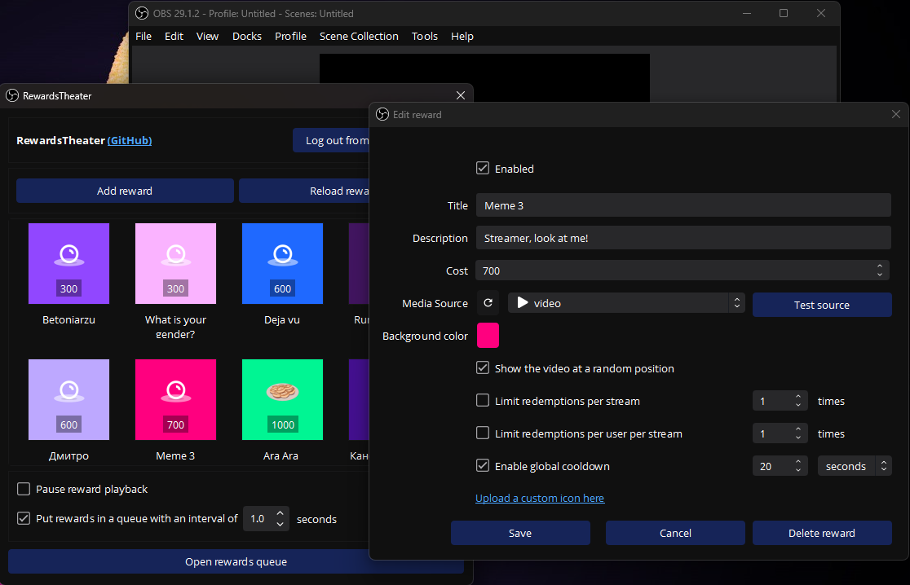
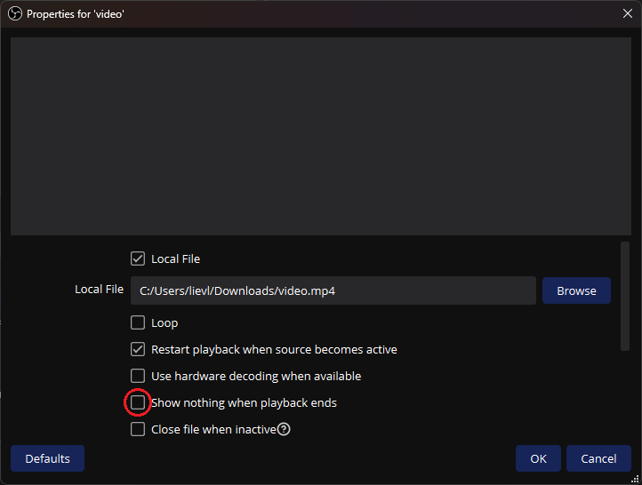
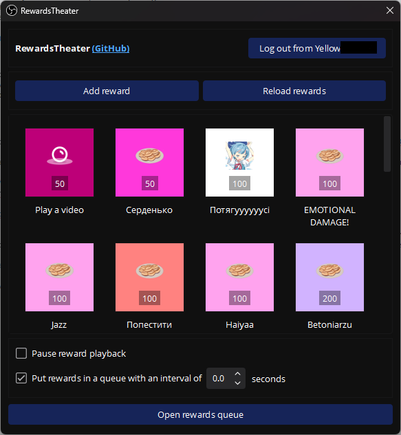

# RewardsTheater

An [OBS](https://obsproject.com/) plugin that lets your viewers redeem videos or sounds on stream via Twitch Channel Points.

[Watch this video](https://youtu.be/-0evZCAlXVU) on how to set everything up.
Or you can read the full instructions below.

[Прочитати українською тут](README_uk.md)

## How's this better than [TR!GGER FYRE](https://overlays.thefyrewire.com/widgets/triggerfyre/)?

- Free and open source.
- Use your locally saved videos, no need to upload anything to the server.
- Has a nice UI to edit channel point rewards right inside OBS!
- Plays the videos natively in OBS without a browser source. This means better FPS and quality.
- Can play a random video if you want (just add several videos to a VLC Video Source).
- Reward redemptions can be put in a queue so that they don't play simultaneously.



## Requirements
- You are a Twitch Affiliate or Partner and have channel points enabled.
- OBS version 29.1.2 or newer.
- Windows or Linux operating system.


## Setting up

### Installing on Windows
1. Install the latest version of Visual C++ Redistributable from [here](https://aka.ms/vs/17/release/vc_redist.x64.exe).
2. Download and run the exe installer from [this link](https://github.com/gottagofaster236/RewardsTheater/releases/latest).
3. Instead of the installer, you can download the zip file and unpack it into your OBS installation folder (usually `C:\Program Files\obs-studio`).
### Installing on Linux
1. For Ubuntu and other Debian-based distros, you can download the deb file from [this link](https://github.com/gottagofaster236/RewardsTheater/releases/latest). Then install it via
   ```
   sudo dpkg -i /path/to/deb/file
   ```
2. You can also install RewardsTheater from Flathub:
   ```
   flatpak install flathub com.obsproject.Studio.Plugin.RewardsTheater
   ```

### Adding a source
1. RewardsTheater supports videos and sounds. The instructions are identical in both cases.
2. Add an OBS source for each video you want to play as a channel points reward. It has to be either Media Source or VLC Video Source:
   
   
3. Select a video file for the source from your computer. If you want the video to appear and hide smoothly, uncheck "Show nothing when playback ends" and select show/hide transitions for the source:
     
     
     
4.  Position the source on the scene in the way that you like.

### Adding a random video source
You can use a VLC Video Source with several videos in the playlist. Then RewardsTheater will play a random video from this playlist every time.

Note that hide transitions are not supported in this case.

### Creating a reward
1. Go to Tools → RewardsTheater.
   
   
2. You'll have to log into Twitch first by clicking the "Log in" button.
3. After that, you can hit "Add reward". Select the source you added earlier as the Media Source for the reward. 
**Hit "Test source" in order to test whether the source will work.**
 Due to the limitations of Twitch API, if you want to upload a custom icon, you're gonna have to do this inside the browser.
   
   

4. You can edit the reward later by clicking on it in the Tools → RewardsTheater menu.

   

5. If there are a lot of rewards, you can put the media sources onto a separate scene, and add that scene to other scenes.

### Monitoring rewards
1. During stream, you can monitor the reward queue if there's a lot of redemptions at the same time and cancel them by clicking the cross button. The viewer's channel points are refunded if you cancel a reward.

   

2. You can click "Pause reward playback" on the main settings screen if you don't want the videos playing for some time. During this time, the user will get their points refunded as well.

## Supporting the developer
If you liked my work, please leave a star on the GitHub repository 🙂

## Building
PRs are welcome! If you want to build RewardsTheater yourself, please refer to [BUILDING.md](BUILDING.md)

## License and credits
- RewardsTheater is licensed under GNU General Public License v3.0. 
- RewardsTheater is a plugin to [OBS Studio](https://github.com/obsproject/obs-studio), which is licensed under GNU General Public License v2.0 or later.
- RewardsTheater uses [Boost.Asio](https://www.boost.org/doc/libs/1_83_0/doc/html/boost_asio.html), [Boost.URL](https://www.boost.org/doc/libs/1_83_0/libs/url/doc/html/index.html), [Boost.Beast](https://www.boost.org/doc/libs/1_83_0/libs/beast/doc/html/index.html), [Boost.JSON](https://www.boost.org/doc/libs/1_83_0/libs/json/doc/html/index.html), which are licensed under the Boost Software License, Version 1.0.
- RewardsTheater uses [Qt Core](https://doc.qt.io/qt-6/qtcore-index.html), [Qt Widgets](https://doc.qt.io/qt-6/qtwidgets-index.html) and [Qt GUI](https://doc.qt.io/qt-6/qtgui-index.html) modules, which are available under GNU General Public License v2.0 or later.
- RewardsTheater uses [OpenSSL](https://openssl.org/), which is licensed under Apache-2.0 License.
- RewardTheater uses Google's [material-design-icons](https://github.com/google/material-design-icons/tree/master), which are licensed under Apache-2.0 license.
